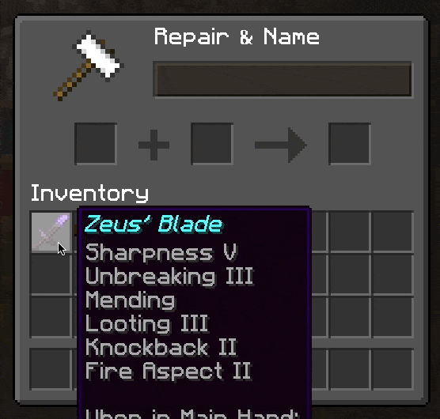

# Optimal Enchant Tool

## TL;DR - How To Download

Click [here](https://github.com/BazzaDEV/OptimalEnchantTool/releases/tag/2.0.0) to download the latest JAR.  
Once download, double-click the JAR to run the tool. 
Nice 'n easy.

## Who is it for?

This tool is designed for Minecraft players who want to enchant their favourite gear, but they quickly realize...
- Enchantments are becoming very expensive, or worst of all...
- They add almost all their enchantments to make their god item, but they get this dreadful message:  

**That's where OET comes in.**

## What does it do?

Simply enter the enchantments you'd like to put on a given item, hit *Calculate*, and OET tells you everything:
- In what order to put everything in the anvil in the cheapest way possible
- How many levels everything will cost you, at each step and at the end
- *(Coming Soon)* Which enchantments conflict with each other, so you know what you're getting into

## Okay, great - now how do I get it?
Alright, fair enough.

### Download the JAR

1. Navigate to **Releases** in the right sidebar, click the latest release, look under **Assets** and download the latest JAR (usually named `OptimalEnchantTool-X.X.X.jar`)
2. Find the JAR you just downloaded on your computer.

### Run the Tool

3. From here, you can run the tool in one of two ways...

#### 1) Run the GUI *(most people should do this)*
Simply double-click the JAR are you're golden!  
*Obviously, I'm going to assume you have your JAVA_HOME path and the rest of those shenanigans in order.*

#### 2) Run the tool from the terminal
This has some advantages:
- You can access **program arguments** to quickly calculate what you need without having to interact with the GUI.
- If you prefer to run the **command line interface**, this is the way to go (*shameless plug alert* - the CLI was built using my very own [SimpleMenus API](https://go.bazza.dev/SimpleMenus) for Java). If this interests you, read the next section.

## Running OET From a Terminal
